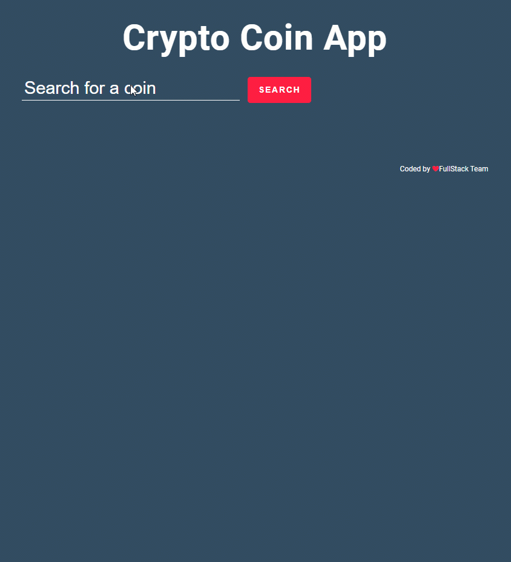

## Description

## Expected Outcome

  - User can search crypto coin around the world crypto coin market.
  - The app can fetch api with the searched crypto coin name(... and apikey if it is obligatory).
  - User can display data of searched crypto coin in coin data card.
  - User can display list of searched crypto coin data card like on gif.
  - If new searched crypto coin is in the crypto card list, app can display a warning text to user on page.

🔥 You can use [Coinranking Api](https://developers.coinranking.com/api/documentation) for your app. 

 <strong>⌛ Happy Coding  ✍</strong> 
